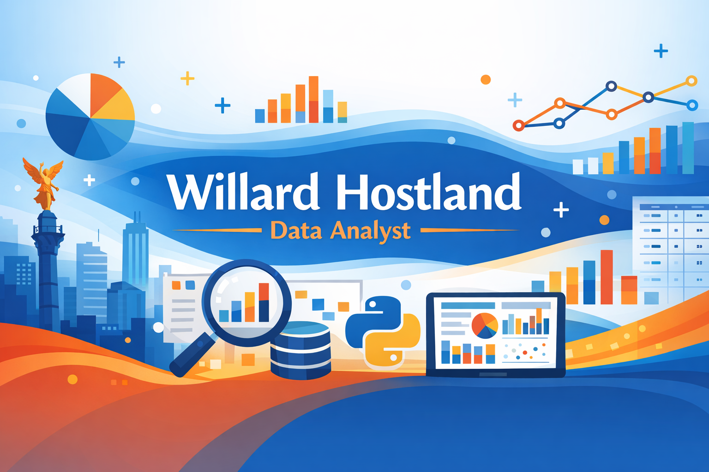

  

# 👋 Hi, I'm **Willard Hostland**
### **Data Analyst — SQL • Python • Tableau • Data Visualization**  
Ciudad de México, México

---

## 🧰 Tech Stack
               

---

## 🌐 About Me

I’m a Data Analyst skilled in transforming complex datasets into **clear, actionable insights** using Python, SQL, Excel, and Tableau. I enjoy uncovering patterns, optimizing processes, and building intuitive dashboards that support strategic decision‑making.

My multidisciplinary background — from engineering to operations to technical leadership — gives me a unique perspective on how data drives business value.

> “I created interactive dashboards to visualize patterns and improve business decision‑making.”  
> *(From my CV)*

---

## 📊 Featured Project

### **Sales Insights Dashboard — TripleTen Bootcamp**  
**Tech:** Python, Pandas, SQL, Tableau  

- Analyzed purchasing patterns to identify key customer behaviors  
- Built interactive Tableau dashboards for business decision‑making  
- Delivered end‑to‑end workflow: data cleaning → analysis → visualization  

🔗 *Add your Tableau Public or GitHub project link here*

---

## 🔎 What I Do

- Exploratory Data Analysis (EDA)  
- Data Cleaning & Wrangling  
- Dashboard Design & KPI Tracking  
- Descriptive & Inferential Statistics  
- A/B Testing  
- Business Insight & Reporting  

---

## 🧩 Professional Background

Before transitioning into data analytics, I spent years leading technical, commercial, and operational teams across multiple industries:

- Senior Sales Manager (5 yrs)  
- Operations Manager for eCommerce development teams (2 yrs)  
- Director of my own engineering company (11 yrs)  
- Commercial Manager handling multimillion‑dollar bids (10 yrs)  
- Test & Repair Engineer in oil exploration systems (6 yrs)  
- Sales Representative in industrial equipment (5 yrs)  
- Navy Lieutenant, Technical Administration Officer (4 yrs)

This experience gives me a strong foundation in **problem‑solving, leadership, and technical execution**.

---

## 📫 Connect With Me

- **Email:** willardantonio@gmail.com  
- **LinkedIn:** *Add your link here*  
- **GitHub:** You’re already here  

---

## 🚀 Currently Working On

- Expanding my analytics portfolio  
- Building more Tableau dashboards  
- Strengthening SQL automation workflows  
- Publishing new Python notebooks  
